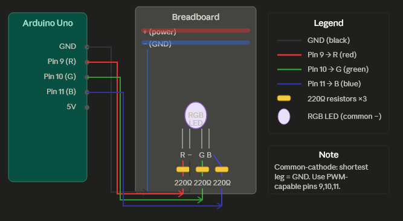

# LED UI – Setup & Run Guide

A browser-based RGB LED controller using the Web Serial API. No backend needed, the browser talks directly to the Arduino over USB.

---

## What you need

- Arduino Uno (or compatible AVR ATmega328P board)
- Common-cathode RGB LED
- 3× 220Ω resistors
- Breadboard + jumper wires
- USB-A to USB-B cable (the square one)
- Chrome or Edge browser (Firefox does not support Web Serial)

---



## 1. Wiring the circuit

```
Arduino Pin 9  ──► 220Ω ──► R leg  (longest aside from cathode)
Arduino Pin 10 ──► 220Ω ──► G leg
Arduino Pin 11 ──► 220Ω ──► B leg
Arduino GND    ──────────► Cathode (shortest leg)
```

**How to identify LED legs**, hold the LED with the flat side facing you. Left to right: R, Cathode (−), G, B.

> Resistors are required. Skipping them will burn out the LED immediately.

---

## 2. Flash the Arduino

### Option A, Arduino IDE (easiest, uses the `.ino` file)

1. Download and install [Arduino IDE](https://www.arduino.cc/en/software).
2. Open `arduino/led_controller.ino`.
3. Go to **Tools → Board → Arduino Uno**.
4. Go to **Tools → Port** and select your Arduino's port:
   - Windows: `COM3`, `COM4`, etc.
   - macOS: `/dev/cu.usbmodem...`
   - Linux: `/dev/ttyUSB0` or `/dev/ttyACM0`
5. Click **Upload** (→ arrow button). Wait for "Done uploading."
6. Close the Arduino IDE, it must not hold the serial port open when the browser connects.

### Option B, avr-gcc toolchain (uses the `.c` file)

Install the toolchain:

```bash
# macOS
brew install avr-gcc avrdude

# Ubuntu / Debian
sudo apt install gcc-avr avrdude
```

Compile and flash:

```bash
# Compile
avr-gcc -mmcu=atmega328p -DF_CPU=16000000UL -Os \
        -o led_controller.elf arduino/led_controller.c -lm

# Convert to hex
avr-objcopy -O ihex led_controller.elf led_controller.hex

# Flash (replace /dev/ttyUSB0 with your port)
avrdude -c arduino -p m328p -P /dev/ttyUSB0 -b 115200 \
        -U flash:w:led_controller.hex
```

---

## 3. Run the UI

1. Plug the Arduino into your computer via USB.
2. Open `index.html` in **Chrome or Edge**.
3. Click the **CONNECT** button in the top bar.
4. A browser popup asks you to pick a serial port, select your Arduino.
5. The dot turns green. All buttons now send live commands.

---

## Serial commands reference

The browser sends plain text over serial at 9600 baud. You can also test manually in the Arduino IDE Serial Monitor (set to 9600, Newline line ending).

| Command | Effect |
|---|---|
| `POWER:ON` | Turn LED on |
| `POWER:OFF` | Turn LED off |
| `BRIGHTNESS:0`–`BRIGHTNESS:100` | Set brightness level |
| `MODE:SOLID` | Steady warm amber |
| `MODE:STROBE` | White flash at 80 ms |
| `MODE:FADE` | Amber breathe cycle |
| `MODE:RAINBOW` | Full hue rotation |
| `MODE:POLICE` | Red/blue alternating |
| `MODE:CANDLE` | Random warm flicker |
| `MODE:SUNRISE` | Deep red → orange ramp |

---

## Troubleshooting

**Port not visible in browser**, make sure the Arduino IDE is fully closed. Only one program can hold the serial port at a time.

**No Web Serial popup**, check you are using Chrome or Edge. Firefox is not supported.

**LED doesn't light up**, check resistors are in place, confirm the cathode leg goes to GND, and verify pins 9/10/11 are used.

**Wrong colors**, legs may be reversed on your LED. Swap the R and B wires and re-test.

**avrdude: stk500_recv() error**, wrong port or baud rate. Try `-b 57600` for older Uno bootloaders.

---

## File structure

```
index.html              Browser UI shell
src/main.js             Web Serial logic + button handlers
styles/main.css         Styling
arduino/
  led_controller.ino    Arduino sketch (upload via IDE)
  led_controller.c      Plain C version (compile with avr-gcc)
```

